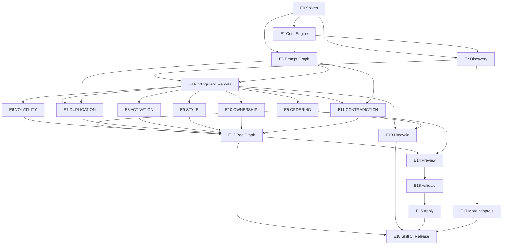

# Prompt Structure Auditor — Build Order

| Field | Value |
|-------|-------|
| **Status** | Draft — for review |
| **Companion** | [Epics, Stories & Releases](./0001-epics-stories-releases.md) |
| **Architecture** | [ADR 0001](../adr/0001-implementation-plan.md), [RFC 0001](../rfc/0001-prompt-structure-auditor.md) |

> This document is the **execution plan**: what order to build, what can run in
> parallel, and what gates a release. It does not redefine requirements — those
> live in the epics/stories doc.

---

## 1. Guiding build rules

1. **Spikes before dependent code** — do not start stories blocked by open
   `[SPIKE-RESULT:*]` placeholders.
2. **Walking skeleton before rules** — R1 has no findings (ADR Phase 1).
3. **One testable release at a time on main** — parallel work is allowed on
   feature branches if it does not merge ahead of its gate.
4. **Rule packs after Finding schema** — packs may be developed in parallel once
   E4-S1/E5-S1 (Finding + RuleRegistry) land.
5. **Recommendation graph after ≥2 packs** — needs real multi-finding fixtures.
6. **Patch after recommendations (preferred)** — preview can start after first
   `patchable` findings (R2), but validate/apply wait for R5 roadmap only if
   sequencing is required; **minimum**: validate/apply after R2 + E14 mechanical
   transforms. Recommended sequence keeps R7 after R5/R6 for cleaner demos.
7. **Every merge keeps determinism + purity green.**

---

## 2. Critical path (serial backbone)

```
R0 Spikes + Core shell
        │
        ▼
R1 Walking skeleton (Discover → Graph → Inventory → JSON → CLI)
        │
        ▼
R2 Findings + ORDER001 + human report
        │
        ├──────────────────────┐
        ▼                      ▼
R3 VOL + DUP              (optional early E14 preview spike on ORDER001)
        │
        ▼
R4 ACT + STYLE + OWN + CONTRA (+ remaining adapters)
        │
        ▼
R5 Recommendation dependency graph + roadmap
        │
        ▼
R6 Baseline diff maturity (non-trivial diffs / CI policies)
        │
        ▼
R7 Preview → Validate → Apply
        │
        ▼
R8 Skill, docs, CI, public v1 / DoD
```

**Critical path length (story-level):**  
E0 spikes → E1 → E2+E3 → E4 inventory/JSON/CLI → E4 findings + E5 ORDER →  
(E6∥E7) → (E8∥E9∥E10∥E11) → E12 → E13 maturity → E14→E15→E16 → E18.

---

## 3. Parallelisation matrix

### Wave 0 — Kickoff (parallel)

| Lane A | Lane B | Lane C |
|--------|--------|--------|
| E0-S1 packaging spike | E0-S2 config spike | E0-S3 ID-anchor spike |
| E0-S4 Cursor activation spike | E0-S5 fixture matrix spike | E0-S6 patch-scratch spike |

**Gate W0:** Spike results filled enough to unblock R1 (packaging, config,
id-anchors, fixture-matrix **required**; cursor-activation can wait until R4;
patch-scratch can wait until R7).

### Wave 1 — R0/R1 foundation (after W0 required spikes)

| Lane A — Core Engine | Lane B — Discovery | Lane C — Graph |
|----------------------|--------------------|----------------|
| E1-S1 package/CLI stub | E2-S1 adapter protocol | E3-S1 frozen types |
| E1-S2 RepoFS | E2-S2 Claude adapter | E3-S2 builder segments |
| E1-S3 config + hash | E2-S3 AGENTS adapter | E3-S3 classifier |
| E1-S4 IDs + canon JSON | E2-S4 Cursor adapter | E3-S4 precedes/references/governs |
| E1-S5 purity harness | E2-S5 config noise | E3-S5 deferred edge stubs |
| E1-S6 empty analyze() | E2-S6 tool skills | |
| | E2-S7 data exclusion | |

**Then integrate (serial short):** E4-S3 inventory · E4-S4 JSON · E4-S6 CLI ·
E13-S1 baseline scaffold · golden fixtures from `[SPIKE-RESULT: fixture-matrix]`.

**Gate R1:** `psa inventory` / `psa audit` on VR1–VR3; inventory matches dry-run
expectations; empty findings; determinism ×2; purity green.

### Wave 2 — R2 first findings

| Lane A | Lane B |
|--------|--------|
| E4-S1 Finding schema | E5-S1 RuleRegistry |
| E4-S2 normalize | E5-S2 ORDER001 |
| E4-S5 human report | E5-S3 ORDER002 (if in R2) |
| | E5-S4 goldens |

**Gate R2:** VR3 shows ORDER001; VR1 no false ORDER; VR2 no false ORDER from
references alone.

### Wave 3 — R3 packs (parallel)

| Lane A — VOLATILITY | Lane B — DUPLICATION |
|---------------------|----------------------|
| E6-S1 VOL001 | E7-S1 duplicates edges |
| E6-S2 VOL002 | E7-S2 DUP001 (VR2+VR3) |
| E6-S3 VR3 signals | E7-S3 independence test |

**Gate R3:** VR2 references-vs-embeds correct; VR2/VR3 duplication findings
present; NF-S6 independence green.

### Wave 4 — R4 packs (parallel, 4 lanes)

| Lane A ACTIVATION | Lane B STYLE | Lane C OWNERSHIP | Lane D CONTRADICTION |
|-------------------|--------------|------------------|----------------------|
| Needs E0-S4 result | E9-S1 STYLE001 VR3 | E10-S1 OWN001 | E11-S1 contradicts edges |
| E8-S1 ACT001 VR2 | E9-S2 extras | E10-S2 BMAD info | E11-S2 CONTRA001 + fixtures |
| E8-S2 ACT002 | | | E11-S3 goldens |
| E8-S3 permissions | | | |

**Optional parallel:** E17-S1…S5 remaining adapters (do not block pack lanes).

**Gate R4:** VR2 ACT findings match dry-run intent; VR3 STYLE001; ownership/tool
informational correct; contradiction fixture green.

### Wave 5 — R5 recommendations (serial after R4)

1. E12-S1 recommendation builder  
2. E12-S2 RecEdges from model  
3. E12-S3 cycles  
4. E12-S4 roadmap in reports  

**Gate R5:** Roadmap topological; not priority-only; ownership-filtered.

### Wave 6 — R6 lifecycle maturity (can overlap late R4 / early R5)

| Parallel with R5? | Stories |
|-------------------|---------|
| Yes (after R2) | E13-S2 diff buckets on synthetic mutations |
| Yes | E13-S3 reprioritised |
| Yes | E13-S4 `psa diff` CLI |
| After policy decision | E13-S5 CI exit codes |

**Gate R6:** Non-empty Introduced/Resolved demos; baseline round-trip; no
composite score.

### Wave 7 — R7 patch (mostly serial; preview can start earlier)

**Earliest start for E14:** after R2 (ORDER001 patchable).  
**Recommended:** after R5 so roadmap and patch demos align.

| Order | Story | Parallel notes |
|-------|-------|----------------|
| 1 | E14-S1…S4 Preview | Can parallelise ORDER vs DUP transform implementations |
| 2 | E15-S1…S3 Validate | Blocked on `[SPIKE-RESULT: patch-scratch]` |
| 3 | E16-S1…S4 Apply | Blocked on validate green |

**Gate R7:** Bad patch refused; good ORDER001 apply on branch; invariant held.

### Wave 8 — R8 release (parallel lanes)

| Docs/Skill | Quality | Distribution |
|------------|---------|--------------|
| E18-S1 SKILL.md | E18-S4 RFC examples | E18-S6 public release |
| E18-S2 user docs | E18-S5 VR1–VR3 smoke sign-off | |
| E18-S3 CI | E17 remainder if any | |

**Gate R8:** ADR §15 Definition of Done checklist complete.

---

## 4. Dependency diagram (epics)



---

## 5. Suggested team / capacity shapes

### Solo agent / solo developer
Follow critical path strictly: W0 → R1 → R2 → R3 → R4 → R5 → R6 → R7 → R8.  
Within R3/R4, still finish one pack before starting the next if context-switching
hurts golden stability.

### Two parallel streams
| Stream Alpha | Stream Beta |
|--------------|-------------|
| Core + Discovery + Graph + Inventory (R1) | Spikes E0-S4, E0-S6, fixture authoring |
| ORDER + report (R2) | VOL fixtures / classifier edge cases |
| DUP (R3) | VOL (R3) |
| ACT + STYLE (R4) | OWN + CONTRA (R4) |
| Rec graph (R5) | Lifecycle diff (R6) |
| Preview (R7) | Validate/Apply (R7) after preview API stable |
| SKILL/docs (R8) | CI + VR smoke matrix (R8) |

### Three streams (after R2)
Add a third lane for **E17 adapters + fixtures** so R8 is not adapter-bound.

---

## 6. Release demo scripts (what “tested functionally” means)

| Release | Demo / test script |
|---------|-------------------|
| **R1** | Run inventory on VR1, VR2, VR3; show present/absent; show config/data exclusions; prove JSON byte-identical on second run |
| **R2** | Audit VR3 → ORDER001 with evidence; audit VR1 → no false ORDER; show honesty note |
| **R3** | VR2: no false volatility on references; VR2/VR3 DUP findings |
| **R4** | VR2: ACT001 dormant rules; VR3: STYLE001 worklog; tool BMAD informational |
| **R5** | Show roadmap: DUP/ACT before ORDER where edged; cycle fixture report |
| **R6** | Save baseline → change fixture → `psa diff` shows Introduced → fix → Resolved |
| **R7** | Preview ORDER001 → validate pass → apply on branch → validate fail on bad patch |
| **R8** | `npx skills` install; CI green; DoD checklist signed |

---

## 7. Risk & re-plan triggers

| Trigger | Re-plan action |
|---------|----------------|
| Packaging spike chooses TypeScript | Keep epic/story IDs; swap ADR D1–D10 implementation notes only |
| Cursor activation semantics unknowable | ACT findings → more `requires-verification`; do not invent IDE behaviour |
| Patch worktree fails on OneDrive (VR3) | Limit apply smoke to local fixtures; document VR3 limitation |
| Contradiction detection too noisy | Ship CONTRA behind config default-off; expand `[SPIKE-RESULT: contradiction-fixtures]` |
| Golden churn from ID anchors | Freeze `[SPIKE-RESULT: id-anchors]` before R2 goldens |

---

## 8. Immediate next actions (upon sign-off)

1. Run **Wave 0 spikes** (especially packaging, config, id-anchors, fixture-matrix).
2. Fill placeholder register in the epics doc.
3. Start **Wave 1 Lane A/B/C** for R1 walking skeleton.
4. Do **not** implement ORDER001 until R1 gate is green.

---

## 9. Document control

| Version | Date | Notes |
|---------|------|-------|
| 0.1 | 2026-07-20 | Initial epics/stories/releases + build order for review |
